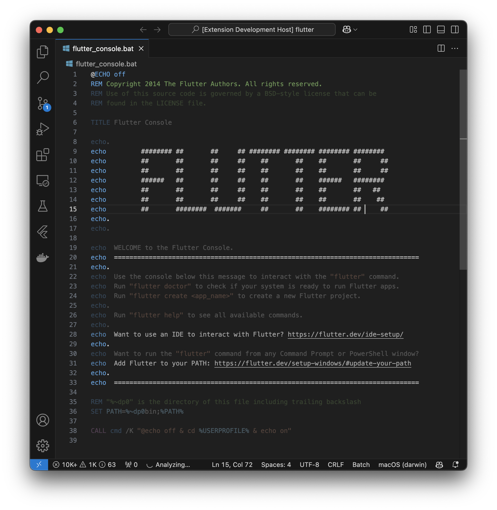

# Cobwebs

Cobwebs is a Visual Studio Code extension that visualizes the age of each line in your code through opacity. Newer lines appear darker, while older lines become more transparent, giving you an instant visual understanding of your code's history.

## Features

- Real-time visualization of line age through opacity
- Works with any Git repository
- Seamlessly integrates with your existing VS Code theme
- Minimal performance impact

## Requirements

- Visual Studio Code 1.85.0 or higher
- Git installed and accessible from the command line
- File must be part of a Git repository

## Installation

1. Open Visual Studio Code
2. Press `Ctrl+P` / `Cmd+P` to open the Quick Open dialog
3. Type `ext install cobwebs` to find and install this extension

## Usage

The extension works automatically once installed. Open any file in a Git repository, and you'll see:

- Newer lines appear with full opacity
- Older lines become progressively more transparent
- Changes are updated in real-time as you switch between files

## Extension Settings

This extension has no configurable settings at this time.

## Known Issues

None at this time.

## Release Notes

### 0.1.0

Initial release of Cobwebs:
- Basic line age visualization through opacity
- Git integration
- Real-time updates

## License

This project is licensed under the MIT License - see the LICENSE file for details.